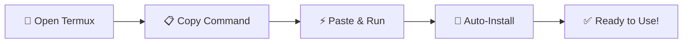

<div align="center">


# *☤ W8HermesAgentTermuxx — Hermes Agent for Android (Termux)*

### *Run a Self-Evolving AI Assistant on Your Phone*

[](https://opensource.org/licenses/MIT)
[](https://termux.com/)
[](https://github.com/NousResearch/hermes-agent)
[](https://github.com/NousResearch/hermes-agent)

**Transform your Android device into a powerful, learning AI assistant**

<h3 align="center">
  
</h3>
</div>

## ✨ What is Hermes Agent?

> **Hermes Agent** is an open-source, self-evolving AI framework developed by [Nous Research](https://github.com/NousResearch/hermes-agent). It's like having **Jarvis in your pocket** - an AI that learns, adapts, and grows smarter with every interaction.

<div align="center">

| 🧠 Self-Learning | 🔄 Cross-Platform | 💾 Persistent Memory | 🛠️ 70+ Tools |
|:----------------:|:------------------:|:-------------------:|:-------------:|
| Gets smarter over time | Works on 16+ apps | Remembers your preferences | Execute complex tasks |

</div>

---

## ⏱️ Installation takes ~5-10 minutes - Grab a coffee! ☕
</div>

## Installation Preview:


# 🚀 **One-Line Installation**

### **Copy and paste this command in Termux:**

```bash
curl -fsSL https://raw.githubusercontent.com/W8SOJIB/W8HermesAgentTermuxx/main/install.sh | bash
```

## 🛠️ Manual Installation (Recommended)
Prefer to do it yourself? Here's the step-by-step:
```
pkg install git
```
```
# 1. Clone this repository
git clone https://github.com/W8SOJIB/W8HermesAgentTermuxx.git
cd W8HermesAgentTermuxx

# 2. Make the script executable
chmod +x install.sh

# 3. Run the installer
./install.sh
```

---

## 📱 Full Termux Step-by-Step Guide

Everything command-level, from a fresh Termux install to a working agent. Run these **one by one** in Termux.

### 1️⃣ Set up Termux (first time)
```bash
# Allow external storage access (where you'll put / download files)
termux-setup-storage
# Grant it, then accept the storage permission popup on your phone.
```

### 2️⃣ Update all packages
```bash
pkg update -y
pkg upgrade -y
```

### 3️⃣ Core packages (needed by Hermes)
```bash
pkg install -y proot-distro git openssh curl wget python nodejs npm
```

### 4️⃣ Build / Python toolchain
```bash
pkg install -y clang make rust pkg-config libffi openssl binutils build-essential
```
> `python` already comes with `pip`. Install these too for smooth Python builds:
```bash
pkg install -y python-pip python3-setuptools wheel
```

### 5️⃣ Useful extras (recommended)
```bash
pkg install -y nano vim ripgrep ffmpeg unzip zip tar which
```

### 6️⃣ (Optional) Proot-Distro Ubuntu
> `proot-distro` lets you run a full Ubuntu Linux inside Termux — this is what `install.sh` uses.
```bash
pkg install -y proot-distro
proot-distro install ubuntu
proot-distro login ubuntu
```
> If it says `container 'ubuntu' already exists`, just run `proot-distro login ubuntu` — it's already there. ✅

### 7️⃣ Run W8HermesAgentTermuxx (one command does it all)
```bash
curl -fsSL https://raw.githubusercontent.com/W8SOJIB/W8HermesAgentTermuxx/main/install.sh | bash
```

### 8️⃣ Start Hermes
```bash
# log into the container (uses 'ubuntu' by default)
proot-distro login ubuntu

# first-time setup
hermes setup

# start chatting
hermes
```

### 🔁 Every package the installer pulls in, at a glance

| Purpose | Command |
|:--------|:--------|
| Base update | `pkg update -y && pkg upgrade -y` |
| Storage access | `termux-setup-storage` |
| Git | `pkg install -y git` |
| proot-distro (Ubuntu) | `pkg install -y proot-distro` |
| Python | `pkg install -y python` |
| Node.js | `pkg install -y nodejs` |
| Compiler toolchain | `pkg install -y clang make rust pkg-config libffi openssl build-essential` |
| Search/copy/edit | `pkg install -y ripgrep ffmpeg nano unzip zip` |
| Inside Ubuntu | `apt install -y python3 python3-pip python3-venv git curl build-essential nodejs npm` |

> **Tip:** In Termux, `pkg` = `apt`. You can swap `pkg install X` for `apt install X` — both work.

---

## 🤖 Start Agent
Run these commands one by one after installing
```
cd
proot-distro login ubuntu
```
```
cd hermes-agent
source venv/bin/activate
```
Run for setting it up
```
hermes setup
```
Run for using it
```
hermes
```
## Start gateway
```
hermes gateway
```

---

## 🗑️ Uninstall (delete the tool)

Removes everything W8HermesAgentTermuxx created: the agent, the launcher, the PATH entry, optionally the proot container, then itself.

**One command:**
```bash
curl -fsSL https://raw.githubusercontent.com/W8SOJIB/W8HermesAgentTermuxx/main/uninstall.sh | bash
```

Or, if you cloned the repo:
```bash
cd W8HermesAgentTermuxx
chmod +x uninstall.sh
./uninstall.sh
```

**What it removes:**

| Item | Removed |
|------|:------:|
| Hermes Agent source + venv (inside container) | ✅ |
| `~/.local/bin/hermes` launcher | ✅ |
| PATH line added to `~/.bashrc` | ✅ |
| proot container `ubuntu` (asks first) | ✅* |
| `uninstall.sh` itself + repo folder | ✅ |

> **\*** It asks before deleting the whole container — if you have other apps in `ubuntu`, press `N` and it keeps the container but still removes Hermes.
>
> Termux itself is **never** touched. To remove Termux entirely: **Settings → Apps → Termux → Uninstall**.

---

## ⚙️ System Requirements

| Requirement | Minimum | Recommended |
|:------------|:-------:|-------------:|
| **Android Version** | 11  |  13,14 or 15 |
| **Storage Space** | 3GB | 5GB+ |
| **RAM** | 2GB | 4GB+ |
| **Internet** | Required | Fast connection |
| **Termux** | Latest | Latest from F-Droid |


## 🌍 Why Run Hermes on Android?

| Benefit |  Description |
|:------------|:-------------:|
| **📱 Portable AI** | Your assistant goes everywhere  |
| **🔒 Privacy** | Runs locally on your device |
| **💰 Cost-effective** | No server hosting fees |
| **⚡ Low latency** | Direct execution |
| **🔄 Always available** | Works offline (with local models) |


## 🎛️ AI Model Freedom
Compatible with 200+ AI models including:

• OpenAI (GPT-4, GPT-3.5)

• Anthropic (Claude)

• Google (Gemini)

• DeepSeek

• Alibaba (Qwen)

• Zhipu (GLM)

• Local models via Ollama

## 🦙 Running Local Models with [Ollama](https://ollama.com)

### 📋 Installation

#### Install Ollama on Termux:
```
pkg install ollama
ollama serve
```
#### Pull & Run Models
```
ollama run gemma4:31b-cloud
```

## 🙏 Acknowledgments
• Nous Research - For creating the amazing Hermes Agent

• Termux Team - For making Android development possible

• Open Source Community - For the countless tools and libraries

• [W8SOJIB](https://github.com/NousResearch/hermes-agent) / **W8Team** — Lead Developer of **W8HermesAgentTermuxx**

• You - For using and supporting this project! ❤️

<div align="center">
    
## **⭐ If this helped you, give it a star! ⭐**
</div>

